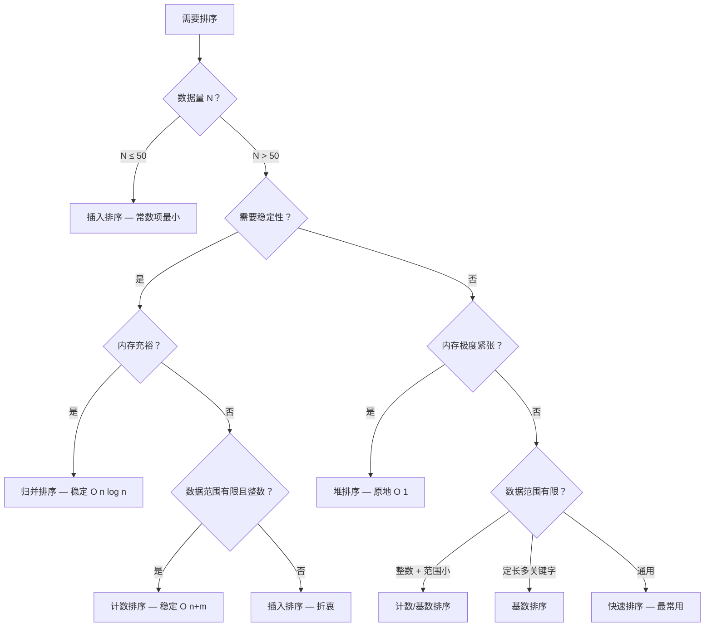

# dart-book-hello-algo-sort-search

> 来源：靳宇栋《Hello 算法》Dart 语言版 Release 1.3.0，2026
> 覆盖章节：第 10 章（搜索）、第 11 章（排序）

## Contents
- [排序算法概览](#一排序算法概览)
- [排序选择决策](#二排序选择决策)
- [二分查找及变体](#三二分查找及变体)
- [哈希优化策略](#四哈希优化策略)
- [Dart 内置排序参考](#五dart-内置排序参考)
- [Workflow: 选择排序与搜索策略](#六workflow-选择排序与搜索策略)

## 一、排序算法概览

### 1.1 对比矩阵

| 算法 | 平均时间 | 最差时间 | 最佳时间 | 空间 | 稳定 | 原地 | 自适应 |
|------|---------|---------|---------|------|-----|-----|-------|
| 选择排序 | O(n²) | O(n²) | O(n²) | O(1) | 否 | 是 | 否 |
| 冒泡排序 | O(n²) | O(n²) | O(n) | O(1) | 是 | 是 | 是(加 flag) |
| 插入排序 | O(n²) | O(n²) | O(n) | O(1) | 是 | 是 | 是 |
| 快速排序 | O(n log n) | O(n²) | O(n log n) | O(log n) | 否 | 是 | 否 |
| 归并排序 | O(n log n) | O(n log n) | O(n log n) | O(n) | 是 | 否 | 否 |
| 堆排序 | O(n log n) | O(n log n) | O(n log n) | O(1) | 否 | 是 | 否 |
| 桶排序 | O(n+k) | O(n²) | O(n+k) | O(n+k) | 是 | 否 | 否 |
| 计数排序 | O(n+m) | O(n+m) | O(n+m) | O(n+m) | 是 | 否 | 否 |
| 基数排序 | O(nk) | O(nk) | O(nk) | O(n+d) | 是 | 否 | 否 |

### 1.2 RIA++ 详解

---

#### 选择排序

**R**：开启一个循环，每轮从未排序区间选择最小的元素，将其交换到已排序区间的末尾。设数组长度为 n，共 n-1 轮循环，每轮内部比较 n-i 次。时间复杂度 O(n²)，非稳定排序。

**I**：每次在剩余元素中找最小值的下标，然后把它和当前轮次的起始位置交换。两层循环：外层控制已排序边界，内层扫描最小值。因为选择后直接交换而非插入，可能打乱相等元素的相对顺序，所以不稳定。

**A1**：对 `[4, 1, 3, 1, 5]` 排序，两个 `1` 的相对顺序可能被破坏——第一个 `1` 被交换到末尾后，顺序反转。

**A2**：数据量 N ≤ 50 且不关心稳定性时可接受；内存极度受限（原地 O(1)）但一般不如插入排序。

**E**：
```dart
void selectionSort(List<int> nums) {
  final n = nums.length;
  for (var i = 0; i < n - 1; i++) {
    int k = i;
    for (var j = i + 1; j < n; j++) {
      if (nums[j] < nums[k]) k = j;
    }
    final tmp = nums[i];
    nums[i] = nums[k];
    nums[k] = tmp;
  }
}
```

**B**：不稳定，交换可能破坏相等元素顺序。

---

#### 冒泡排序

**R**：连续地比较与交换相邻元素实现排序。每轮将未排序区间内的最大元素"冒泡"到末尾。可加 `swapped` 标志位，若某轮无交换说明已有序，提前终止。

**I**：从前往后两两比较相邻元素，大的往后走（如气泡上浮）。每次内循环把当前范围的最大值推到右端。加 flag 后最佳情况 O(n)——一轮扫描无交换即退出。

**A1**：对 `[4, 1, 3, 1, 5]` 排序，第一轮把 `5` 推到最后，第二轮把 `4` 推到倒数第二……相等元素只在 `>` 时交换，故稳定。

**A2**：教学场景最常用；小数据量且需要稳定排序时可用，但常数项比插入大。

**E**：
```dart
void bubbleSort(List<int> nums) {
  final n = nums.length;
  for (var i = n - 1; i > 0; i--) {
    var swapped = false;
    for (var j = 0; j < i; j++) {
      if (nums[j] > nums[j + 1]) {
        final tmp = nums[j];
        nums[j] = nums[j + 1];
        nums[j + 1] = tmp;
        swapped = true;
      }
    }
    if (!swapped) break;
  }
}
```

**B**：无 flag 退化；每轮只冒泡一个元素，大数据量下极慢。

---

#### 插入排序

**R**：在未排序区间选择一个基准元素，将该元素与其左侧已排序区间的元素逐一比较大小，并将其插入到正确的位置。时间复杂度 O(n²)，但常数项小，在小数据量和几乎有序的数据上表现优异。

**I**：就像打扑克时整理手牌——每次拿到一张新牌，从右往左和已有的牌比较，找到合适位置插入。左侧已排序区间始终保持有序。因为它只是"挤"出一个位置放入元素，相等元素不会互换顺序，因此稳定。

**A1**：对 `[3, 2, 1, 5, 4]` 排序，第一轮 `3` 已有序，第二轮把 `2` 插入到 `3` 之前变成 `[2, 3]`，第三轮 `1` 插入到最前……

**A2**：数据库中小批量数据的"最后排序"；快速排序递归到子数组 ≤ 15 时切换插入排序（多数语言 sort() 内部策略）；在线处理（数据流式到达）。

**E**：
```dart
void insertionSort(List<int> nums) {
  final n = nums.length;
  for (var i = 1; i < n; i++) {
    final base = nums[i];
    var j = i - 1;
    while (j >= 0 && nums[j] > base) {
      nums[j + 1] = nums[j];
      j--;
    }
    nums[j + 1] = base;
  }
}
```

**B**：大规模乱序数据 O(n²) 不可接受。

---

#### 快速排序

**R**：选取一个基准数（pivot），将数组分为"小于基准数"和"大于基准数"两个子数组，再递归地对子数组排序。哨兵划分的核心操作是从两端向中间扫描交换。平均时间复杂度 O(n log n)，但若每次选到最值元素退化为 O(n²)。不稳定。

**I**：分治策略的典范。每轮选一个 pivot，然后用双指针从左右两端向中间扫描：左边找到 ≥ pivot 的元素，右边找到 ≤ pivot 的元素，交换两者，直到指针相遇。递归处理左右子数组。随机选择 pivot 或三数取中法可规避退化。平均跑得最快的通用排序算法。

**A1**：对 `[3, 2, 1, 5, 4]`，选 `3` 为 pivot，左指针找到 `5`，右指针找到 `1`，交换得 `[3, 2, 5, 1, 4]`，直至指针相遇，最终 pivot 与 `1` 交换得 `[1, 2, 3, 5, 4]`，左侧 `< 3`，右侧 `> 3`。

**A2**：通用排序首选（Dart `List.sort()` 内部实现）；大数据量、不要求稳定性的场景。

**E**：
```dart
void quickSort(List<int> nums, int left, int right) {
  if (left >= right) return;
  final pivot = _partition(nums, left, right);
  quickSort(nums, left, pivot - 1);
  quickSort(nums, pivot + 1, right);
}

int _partition(List<int> nums, int left, int right) {
  int i = left, j = right;
  final pivot = nums[left];
  while (i < j) {
    while (i < j && nums[j] >= pivot) j--;
    while (i < j && nums[i] <= pivot) i++;
    final tmp = nums[i];
    nums[i] = nums[j];
    nums[j] = tmp;
  }
  nums[left] = nums[i];
  nums[i] = pivot;
  return i;
}
```

**B**：不稳定（相等元素可能互换位置）；最差 O(n²) 需用随机基准/三数取中规避；递归栈深 O(log n) 需注意栈溢出。

---

#### 归并排序

**R**：基于分治策略，划分为"划分阶段"（递归将数组从中点平分为两个子数组）和"合并阶段"（将有序子数组合并为一个有序数组）。时间复杂度稳定 O(n log n)，空间 O(n)（合并阶段需辅助数组）。稳定排序。

**I**：先一刀切到底——不停对半分直到子数组仅含一个元素（天然有序）。再自底向上合并：用两个指针分别指向两个有序子数组的头部，每次取较小者放入临时数组。相等时取左侧元素，因此稳定。O(n) 辅助空间是代价，但对链表排序时可原地合并。

**A1**：对 `[3, 2, 1, 5, 4]`，分到 `[3] [2] [1] [5] [4]`，合并 `[2,3]` 和 `[1]` → `[1,2,3]`，合并 `[4,5]` → `[4,5]`，最终合并得 `[1,2,3,4,5]`。

**A2**：要求稳定排序的场景（多级排序中保留前一轮顺序）；链表排序（可原地合并，无 O(n) 空间开销）；外部排序（海量数据分块排序后合并）。

**E**：
```dart
void mergeSort(List<int> nums, int left, int right) {
  if (left >= right) return;
  final mid = (left + right) ~/ 2;
  mergeSort(nums, left, mid);
  mergeSort(nums, mid + 1, right);
  _merge(nums, left, mid, right);
}

void _merge(List<int> nums, int left, int mid, int right) {
  final tmp = List<int>.filled(right - left + 1, 0);
  int i = left, j = mid + 1, k = 0;
  while (i <= mid && j <= right) {
    if (nums[i] <= nums[j]) {
      tmp[k++] = nums[i++];
    } else {
      tmp[k++] = nums[j++];
    }
  }
  while (i <= mid) tmp[k++] = nums[i++];
  while (j <= right) tmp[k++] = nums[j++];
  for (var p = 0; p < tmp.length; p++) {
    nums[left + p] = tmp[p];
  }
}
```

**B**：O(n) 辅助空间（数组排序的硬伤）；常数项比快排大，实际运行慢于快排。

---

#### 堆排序

**R**：利用堆数据结构实现的排序。首先将数组构建为最大堆，然后依次将堆顶元素（最大值）与堆底元素交换，并缩小堆的范围，对新堆顶执行"从顶至底堆化"。时间复杂度严格 O(n log n)，原地排序，但不稳定。

**I**：建堆阶段将数组转化为大顶堆（从最后一个非叶节点开始自底向上堆化）。排序阶段不断取出堆顶最大值放到数组末尾，然后对剩余部分重新下沉堆化。优势是 O(1) 额外空间且性能稳定，适合内存极度受限场景。

**A1**：数组 `[4, 10, 3, 5, 1]` → 建堆 → `[10, 5, 3, 4, 1]` → 交换堆顶与堆底 → `[1, 5, 3, 4, 10]` → 堆化 → `[5, 4, 3, 1, 10]` → 循环……

**A2**：嵌入式/小内存设备；需要 O(n log n) 且不接受快排退化风险但可接受不稳定的场景。

**E**：
```dart
void heapSort(List<int> nums) {
  final n = nums.length;
  for (var i = (n ~/ 2) - 1; i >= 0; i--) _siftDown(nums, n, i);
  for (var i = n - 1; i > 0; i--) {
    final tmp = nums[0];
    nums[0] = nums[i];
    nums[i] = tmp;
    _siftDown(nums, i, 0);
  }
}

void _siftDown(List<int> nums, int n, int i) {
  while (true) {
    int l = 2 * i + 1, r = 2 * i + 2, ma = i;
    if (l < n && nums[l] > nums[ma]) ma = l;
    if (r < n && nums[r] > nums[ma]) ma = r;
    if (ma == i) break;
    final tmp = nums[i];
    nums[i] = nums[ma];
    nums[ma] = tmp;
    i = ma;
  }
}
```

**B**：不稳定（堆化过程中交换破坏相对顺序）；缓存不友好（跳转访问）；实际运行通常慢于快排。

---

#### 桶排序 / 计数排序 / 基数排序（线性排序）

**R**：非比较排序，利用数据本身的特性（取值范围、数位长度）绕过比较，达到 O(n) 级别。桶排序将数据分散到多个桶内各自排序后合并；计数排序统计各值的出现次数并通过前缀和确定位置；基数排序从低位到高位对每一位实施稳定计数排序。

**I**：这三种排序都用"空间换时间"把 O(n log n) 的比较下界突破到 O(n)。桶排序先分桶再桶内排序（桶内通常用插入/快排）；计数排序直接统计每个值的出现次数，然后按顺序"铺回"结果数组；基数排序逐位排序（从个位到最高位），每一趟用计数排序保证稳定性。

**A1**：计数排序处理 `[2, 1, 1, 0, 3]` → count 数组 `[1, 2, 1, 1]` → 前缀和 `[1, 3, 4, 5]` → 将元素按前缀和放到正确位置。

**A2**：计数排序——成绩排名（0-100 分）、年龄统计等取值范围有限的整数；基数排序——身份证号排序、IP 地址排序等定长多关键字排序；桶排序——均匀分布的浮点数、海量数据预分割。

**E**（计数排序示例）：
```dart
void countingSort(List<int> nums) {
  final m = nums.reduce((a, b) => a > b ? a : b);
  final counter = List<int>.filled(m + 1, 0);
  for (final num in nums) counter[num]++;
  var i = 0;
  for (var val = 0; val <= m; val++) {
    for (var c = 0; c < counter[val]; c++) {
      nums[i++] = val;
    }
  }
}
```

**B**：计数排序要求数据为**非负整数**且 **取值范围 m 不能太大**（空间 O(n+m) 若 m ≫ n 浪费严重）；基数排序要求数据可表示为固定位数的关键字；桶排序依赖数据均匀分布，分布不均时某桶承载过多元素退化。

---

## 二、排序选择决策



**一句话决策**：小就用插入，要稳就归并，内存紧用堆，通用选快排，范围有限用计数。

---

## 三、二分查找

### 3.1 标准二分查找

**R**：在有序数组中，每次取区间中点与目标值比较，根据比较结果将搜索范围缩小一半。时间复杂度 O(log n)，仅适用于有序数据。

**I**：核心是维护一个 `[left, right]` 闭区间，每次算 `mid`，若 `nums[mid] == target` 返回下标；若 `target < nums[mid]` 则 `right = mid - 1`；否则 `left = mid + 1`。循环终止条件是 `left > right`。在移动端、物联网等计算资源受限环境下极为实用。

**A1**：在 `[1, 3, 5, 7, 9, 11, 13]` 中找 `7`：mid=3(7) 命中返回 3。找 `6`：mid=3(7)→左缩，mid=1(3)→右缩，mid=2(5)→右缩，left>right，返回 -1。

**A2**：有序数组中定位特定值（基础用法）；搜索建议的自动补全、IP路由表查找；数据库索引 B+ 树的核心逻辑。

**E**：
```dart
int binarySearch(List<int> nums, int target) {
  int left = 0, right = nums.length - 1;
  while (left <= right) {
    final mid = left + (right - left) ~/ 2;
    if (nums[mid] == target) return mid;
    if (nums[mid] < target) {
      left = mid + 1;
    } else {
      right = mid - 1;
    }
  }
  return -1;
}
```

**B**：数组必须已排序！无序数据必须先用 O(n log n) 排序；仅适用于随机访问数据结构（数组），不适用于链表；若数组频繁插入/删除，维护有序性的成本很高。

---

### 3.2 二分查找变体：查找插入点

**R**：当目标元素不存在时，返回该元素应插入的位置（保持数组有序）。这是 `left` 指针的含义——循环结束时 `left` 指向第一个 ≥ target 的元素位置。

**I**：与标准二分几乎相同，只是不提前返回（不在 `mid` 命中时 return），而是在循环结束后返回 `left`。`left` 在退出时刚好指向插入位置——0 到 n 之间。

**A1**：在 `[1, 3, 5, 7, 9]` 中找 `6` 的插入点：最终 left=3 → 应插入在 index 3（7 之前）。

**A2**：实现有序集合的 `add()` 方法；合并两个有序列表；在排序数组中找第一个 ≥ target 的位置（lower_bound）。

**E**：
```dart
int binarySearchInsertion(List<int> nums, int target) {
  int left = 0, right = nums.length - 1;
  while (left <= right) {
    final mid = left + (right - left) ~/ 2;
    if (nums[mid] < target) {
      left = mid + 1;
    } else {
      right = mid - 1;
    }
  }
  return left;
}
```

**B**：返回的是第一个 ≥ target 的位置（重复元素时插在最左侧）。

---

### 3.3 二分查找变体：查找左/右边界

**R**：在含重复元素的有序数组中找到目标值的起始和结束位置。左边界二分：遇到 `nums[mid]==target` 时继续向左搜；右边界二分：遇到相等时继续向右搜。

**I**：左边界：`nums[mid] >= target` 时 `right = mid - 1`，最终 `left` 停在第一个 target 位置。右边界：`nums[mid] <= target` 时 `left = mid + 1`，最终 `right` 停在最后一个 target 位置。需额外验证——检查 `left` 是否越界且 `nums[left] == target`。

**A1**：在 `[1, 2, 2, 2, 3, 4]` 中找 `2` → 左边界返回 1，右边界返回 3。

**A2**：搜索一个值在数组中的出现次数（`right - left + 1`）；区间查询（如"价格在 100-200 之间的商品"）；数据去重统计。

**E**：
```dart
int binarySearchLeftEdge(List<int> nums, int target) {
  int left = 0, right = nums.length - 1;
  while (left <= right) {
    final mid = left + (right - left) ~/ 2;
    if (nums[mid] < target) {
      left = mid + 1;
    } else {
      right = mid - 1;
    }
  }
  if (left == nums.length || nums[left] != target) return -1;
  return left;
}

int binarySearchRightEdge(List<int> nums, int target) {
  int left = 0, right = nums.length - 1;
  while (left <= right) {
    final mid = left + (right - left) ~/ 2;
    if (nums[mid] <= target) {
      left = mid + 1;
    } else {
      right = mid - 1;
    }
  }
  if (right < 0 || nums[right] != target) return -1;
  return right;
}
```

**B**：返回值需做越界和目标值相等性校验；仅适用于有序数组。

---

### 3.4 二分查找前提条件

| 条件 | 说明 |
|------|------|
| 数据有序 | 数组必须按升序（或降序）排列，否则二分逻辑失效 |
| 随机访问 | 必须能在 O(1) 时间内访问任意位置元素 → 数组、列表 |
| 静态/低频更新 | 若频繁增删，维护有序性的 O(n) 代价可能抵消 O(log n) 优势 |
| 非链表 | 链表取中点需 O(n) 遍历，二分退化为 O(n log n)，此时不如遍历 |

> 思考题：有序链表若要支持 O(log n) 查询，用什么数据结构？答案：跳表（Skip List）。

---

## 四、哈希查找（空间换时间）

**R**：使用哈希表建立键值映射，通过哈希函数计算出目标元素的存储位置，实现 O(1) 平均查询效率。但需要 O(n) 额外空间，且无法进行范围查询。

**I**：当你需要反复查找某个值时，把查找从 O(n) 降到 O(1) 的最简单策略就是——先建一个哈希表。比如"两数之和"题：`target - nums[i]` 是否出现过？用 HashMap 一次遍历就解决，暴力 O(n²) → 哈希 O(n)。代价是内存。

**A1**：LeetCode 两数之和：遍历数组 `[2, 7, 11, 15]`，target=9。遍历到 7 时，在 HashMap 中查 `9-7=2` 存在 → 返回 `[0, 1]`。

**A2**：高频查询且无须范围/顺序的场景；去重（Set）；缓存层（LRU）；统计频率、计数。

**E**：
```dart
List<int> twoSum(List<int> nums, int target) {
  final map = <int, int>{};
  for (var i = 0; i < nums.length; i++) {
    final complement = target - nums[i];
    if (map.containsKey(complement)) return [map[complement]!, i];
    map[nums[i]] = i;
  }
  return [];
}
```

**B**：O(n) 额外空间；无序——需要范围查询或 topK 时不如堆/树；哈希冲突严重时退化 O(n)。

---

## 五、重述算法（盲打模板）

### 快速排序（核心模板）

```
选 pivot → 左右指针 → 循环交换 → pivot 归位 → 递归左右
```

### 归并排序（核心模板）

```
递归平分 → 合并两个有序数组 → 辅助数组拷贝回原数组
```

### 二分查找（核心模板）

```
while left <= right:
  mid = left + (right-left)/2
  相等返回 / 比目标小左移 / 比目标大右移
```

### 哈希优化（核心模板）

```
遍历 → target - current 是否在哈希表中 → 找到返回 / 否则存入
```

---

## 六、搜索方法四象限选择

| 维度 | 线性搜索 | 二分查找 | 哈希查找 | 树查找 |
|------|---------|---------|---------|-------|
| 时间复杂度 | O(n) | O(log n) | O(1) 平均 | O(log n) |
| 空间开销 | O(1) | O(1) | O(n) | O(n) |
| 数据有序要求 | 否 | 是 | 否 | 是(部分有序) |
| 范围查询 | 否 | 是(有序) | 否 | 是 |
| 更新友好性 | 好(O(1)增删) | 差(O(n)维护) | 好(O(1)平均) | 中(O(log n)) |
| 适用场景 | 小数据/单次/高频更新 | 有序数组/低频增删 | 高频查询/无范围 | 海量+有序+范围 |

---

## 七、Dart 内置排序参考

```dart
// Dart 内置 sort——内部使用 TimSort（归并+插入的混合排序），稳定
final nums = [3, 1, 4, 1, 5];
nums.sort();                        // 升序，原地修改
nums.sort((a, b) => b.compareTo(a)); // 自定义比较器

// 获取排序后的新列表（不修改原列表）
final sorted = [...nums]..sort();

// 二分查找——需要 package:collection
import 'package:collection/collection.dart';
final idx = binarySearch(nums, 4);   // 返回下标，未找到返回 -1
```

---

## 八、边界限制汇总

| 边界 | 详情 |
|------|------|
| 比较排序下界 | 基于比较的排序理论最优为 O(n log n)，要突破必须用非比较排序 |
| 快排退化 | 选到最值 pivot 退化为 O(n²)，用随机 pivot 或三数取中解决 |
| 二分查找前提 | 数据必须有序且支持随机访问，不适用于链表 |
| 计数排序限制 | 数据须为非负整数，且取值范围 m 不能远大于 n（否则空间浪费） |
| 基数排序限制 | 数据可表示为固定位数的关键字（如数字、定长字符串） |
## Workflow: 选择排序与搜索策略

### Task Progress

- [ ] **Step 1: 分析数据特征。** 数据量大小？是否有序？需要稳定性吗？内存限制？
- [ ] **Step 2: 选择排序算法。** 参照排序对比矩阵，根据数据特征选最优算法。
- [ ] **Step 3: 实现排序。** 优先使用 Dart 内置 `sort()`（TimSort），特殊场景才手写。
- [ ] **Step 4: 选择搜索策略。** 数据有序且需多次搜索 → 二分；高频查询 → 哈希；小数据 → 线性。
- [ ] **Step 5: 处理边界。** 数据是否有序（二分前提）？哈希冲突处理？浮点比较用 epsilon？
- [ ] **Step 6: 运行测试。** 验证排序正确性（有序性检查）和搜索准确性。

### 条件逻辑

- **如果 n < 50** → 用插入排序或内置 sort
- **如果需要稳定性** → 归并排序或 Dart sort()（TimSort 稳定）
- **如果数据范围远小于 n** → 计数排序
- **如果数据基本有序** → 插入排序 / 冒泡排序（加 early exit）
- **如果数据可表示为固定位数** → 基数排序

## Examples

### 排序选择实例

```dart
// 场景1: 小数据量排序 → Dart 内置
final small = [3, 1, 4, 1, 5];
small.sort(); // TimSort，稳定，原地

// 场景2: 大数据 + 需稳定 → 归并排序
List<int> mergeSort(List<int> arr) {
  if (arr.length <= 1) return arr;
  final mid = arr.length ~/ 2;
  final left = mergeSort(arr.sublist(0, mid));
  final right = mergeSort(arr.sublist(mid));
  return _merge(left, right);
}

// 场景3: 海量数据 + 范围小 → 计数排序
List<int> countingSort(List<int> arr) {
  if (arr.isEmpty) return [];
  final max = arr.reduce((a, b) => a > b ? a : b);
  final count = List.filled(max + 1, 0);
  for (final x in arr) count[x]++;
  final result = <int>[];
  for (var i = 0; i <= max; i++) {
    result.addAll(List.filled(count[i], i));
  }
  return result;
}
```

### 二分查找实例

```dart
// 标准二分查找
int binarySearch(List<int> nums, int target) {
  var i = 0, j = nums.length; // [i, j)
  while (i < j) {
    final mid = i + (j - i) ~/ 2;
    if (nums[mid] < target) {
      i = mid + 1;
    } else if (nums[mid] > target) {
      j = mid;
    } else {
      return mid;
    }
  }
  return -1;
}

// 查找插入点（左边界）
int binarySearchInsertion(List<int> nums, int target) {
  var i = 0, j = nums.length;
  while (i < j) {
    final mid = i + (j - i) ~/ 2;
    if (nums[mid] < target) { i = mid + 1; }
    else { j = mid; }
  }
  return i; // 返回最左插入位置
}
```
